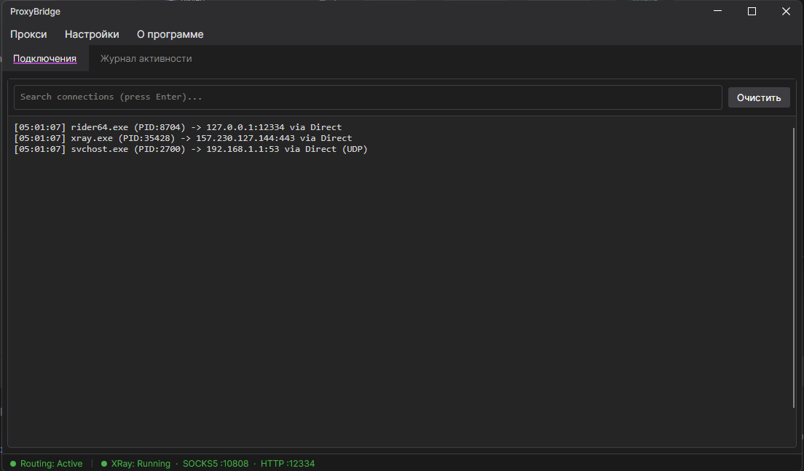

# ProxyBridge + XRay Reality — Windows GUI

  

**ProxyBridge** is a lightweight, open-source Windows proxy client (Proxifier alternative) that transparently routes TCP and UDP traffic from specific applications through SOCKS5 or HTTP proxies — with built-in support for **XRay VLESS+REALITY** tunneling.

This fork extends the original [ProxyBridge](https://github.com/InterceptSuite/ProxyBridge) Windows GUI with a full XRay Reality integration: manage the xray-core subprocess directly from the UI, import server configs via `vless://` share links, and auto-connect on application launch.

---

**ProxyBridge** — лёгкий Windows-клиент с открытым исходным кодом (альтернатива Proxifier), который прозрачно маршрутизирует TCP и UDP трафик выбранных приложений через SOCKS5 или HTTP прокси — со встроенной поддержкой туннелирования **XRay VLESS+REALITY**.

Этот форк расширяет оригинальный [ProxyBridge](https://github.com/InterceptSuite/ProxyBridge) Windows GUI полноценной интеграцией XRay Reality: управление subprocess xray-core прямо из интерфейса, импорт конфигурации сервера по ссылке `vless://`, автоподключение при запуске приложения.

---

## Features / Возможности

### Routing / Маршрутизация
- **Process-based routing** — route, block, or allow traffic per application / маршрутизация трафика на уровне процессов
- **SOCKS5 & HTTP proxy support** / поддержка SOCKS5 и HTTP прокси
- **Kernel-level interception** via WinDivert / перехват на уровне ядра через WinDivert
- **Rules engine** — per-process, per-host, per-port, TCP/UDP, wildcards / гибкие правила маршрутизации
- **DNS via proxy** / DNS через прокси
- **Independent start/stop** for routing and XRay modules / независимый запуск/остановка маршрутизации и XRay

### XRay Reality / XRay Reality
- **Start/stop xray-core** from the GUI without leaving the app / запуск/остановка xray-core прямо из интерфейса
- **VLESS+REALITY** protocol with SOCKS5 + HTTP inbounds / протокол VLESS+REALITY с SOCKS5 и HTTP inbound
- **Import from `vless://` URL** — paste a share link to auto-fill all settings / импорт из ссылки `vless://`
- **Auto-download xray-core** — if the binary is not found, the app offers to download it from GitHub Releases / автоматическая загрузка xray-core при отсутствии бинарного файла
- **Auto-start on launch** — configurable independently for routing and XRay / автозапуск при старте — настраивается отдельно для маршрутизации и XRay
- **Binary auto-detection**: configured path → PATH → app directory / автопоиск бинарного файла

### Interface / Интерфейс
- Modern dark Avalonia UI (.NET 10) / современный тёмный интерфейс на Avalonia (.NET 10)
- **English / Russian** localization / локализация на английском и русском
- Status bar with dual indicators for routing and XRay / статус-бар с индикаторами для маршрутизации и XRay
- Traffic and activity log / журнал трафика и активности

---

## Requirements / Требования

- **OS**: Windows 10 or later (64-bit) / Windows 10 и новее (64-bit)
- **Privileges**: Administrator / права администратора
- **.NET**: bundled — no separate installation required / входит в сборку, отдельная установка не нужна
- **XRay**: downloaded automatically or provide your own `xray.exe` / скачивается автоматически или укажите свой `xray.exe`

---

## Getting Started / Начало работы

1. Download the latest release from [Releases](https://github.com/Visp1024/ProxyBridgeXRay/releases) and run `ProxyBridge.exe` as Administrator.
2. Open **Proxy → XRay Reality Settings** and paste your `vless://` link into the Import field, or fill in the fields manually.
3. Click **Start XRay** from the Proxy menu. ProxyBridge will automatically route traffic through the local XRay SOCKS5 port.
4. To enable auto-connect: check **Auto-start XRay on Launch** in the Proxy menu or in XRay Settings.

---

1. Скачайте последний релиз из [Releases](https://github.com/Visp1024/ProxyBridgeXRay/releases) и запустите `ProxyBridge.exe` от имени администратора.
2. Откройте **Proxy → XRay Reality Settings** и вставьте ссылку `vless://` в поле импорта, или заполните поля вручную.
3. Нажмите **Start XRay** в меню Proxy. ProxyBridge автоматически начнёт маршрутизировать трафик через локальный SOCKS5 порт XRay.
4. Для автоподключения при старте: включите **Auto-start XRay on Launch** в меню Proxy или в настройках XRay.

---

## Screenshots / Скриншоты

  
   
  <em>Main Interface / Главный интерфейс</em>

  
   
  <em>Proxy Settings / Настройки прокси</em>

  
   
  <em>Proxy Rules / Правила маршрутизации</em>

---

## License / Лицензия

MIT License — see [LICENSE](LICENSE) for details.

---

## Credits / Благодарности

- [WinDivert](https://reqrypt.org/windivert.html) by basil00 — kernel-level packet interception
- [Avalonia UI](https://avaloniaui.net/) — cross-platform .NET UI framework
- [xray-core](https://github.com/XTLS/Xray-core) — VLESS+REALITY proxy core
- Original [ProxyBridge](https://github.com/InterceptSuite/ProxyBridge) by Sourav Kalal / InterceptSuite